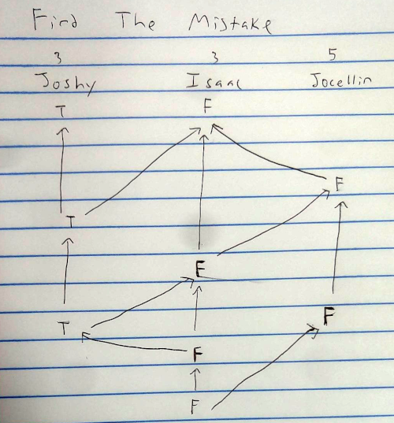

# Breakout Session Ideas (propose your own too)
============================
* Rholang Fundamentals revisited
* RChain’s CBC Casper Consensus Protocol (co-developed by Vlad Zamfir of Ethereum)
* Casper Friendly Ghost
* How to launch a secure RChain network
* Formal semantics of Rholang
* Current state of RChain Platform Development
* How RChain tokens and purses are more scalable than Ethereum
* Rholang and Byzantine fault tolerance
* English Korean technical vocab exchange
* Specific topics in Rholang
* Modern Cryptography (Stream Ciphers, Block ciphers, MACs, hashes)
* Casper friendly finality gadget
* Object Capabilities

# Points to Earn
================
1. Any [AOC](https://adventofcode.com/) problem in Rholang (5 points each)
Solve any problem from the Advent of Code in Rholang. You don't need to read the input files, you can  just put the small example input in your code.

2. Make a playable Casper game (GhostStory) like BitStory (4 points)
BitStory is a fun interactive way to learn Proof of Work. We don't yet have such a game for casper. Describe and demonstrate such a game.

3. Separate nth-caller game to two webpages (3 points)
One page for people who want to host games. Another page for people who want to play games.

4. Solve all exercises any lesson in rholang tutorial (3 points each lesson)
Each lesson contains several programming exercises. Complete all the exercises in a single lesson for 3 points each.

5. Translate any [Learn Rholang By Example](https://github.com/JoshOrndorff/LearnRholangByExample) lesson (3 points each lesson)
Upload the result to GitHub.

6. Rholang GCD (3 points)
Write a program that can compute the [greatest common divisor](https://en.wikipedia.org/wiki/Greatest_common_divisor) of two integers

7. Rholang sumList (2 points)
write a Rholang contract that adds all of the integers in a list. For example

```
sumList!([1, 2, 3, 4, 5], *answer) // gives 15
```

8. Rholang Factorial (2 points)
Write a Rholang contract that takes an integer and computes the factorial of that integer. For example factorial!(3) = 6

9. Rholang countDownFromTo (2 points)
Write a Rholang contract that takes in a start and end number and prints all the number in between. For example

```
countDownFromTo!(6, 3) // 6, 5, 4, 3
```

10. Rholang isPrime (2 points)
Write a Rholang contract that takes in an integer and tells whether it is prime.

11. Rholang Int to String (2 points)
Rholang does not have a nice way to turn an integer into a string. Write a contract that does so.

12. Translate Rholang cheatsheet (3 points)

13. Write a mini lesson about Casper friendly finality gadget (5 points)
Ethereum also plans to use Casper proof of stake. But they currently use proof of work. The transition they will use a hybrid system called "Friendly Finality Gadget"
https://arxiv.org/pdf/1710.09437.pdf
https://vitalik.ca/files/casper_note.html

Isaac and Joshy don't know much about casper FFG. Write a short lesson about FFG.

14. Get nth-caller dApp running (4 points)
Yesterday we saw the nth-caller dApp (decentralized app) running on rchain. Run the dApp on your own RNode.

15. Get status dApp running (4 points)
nth-caller is our most basic example dApp. A similar but more advanced dApp is [status](https://github.com/dckc/Rchain-Status) Get status running. It requires the [RSign](https://github.com/dckc/RSign) browser extension

16. Remove nonce field from Status dapp frontend (5 points)
The status dApp makes the user remember their nonce and type it into the user interface. It would be nicer for the program to ask the blockchain which nonce is coming next.

17. Find text whose sha256 hash starts with 7 zeros (2 points)
You should write your own program in any programming language that finds this text. You may (and should) use an existing hashing function, but you should write the main program yourself.

(+4 points for using Rholang)

18. Encode the Boolean operator OR in lambda calculus (4 points)
Isaac showed how to make the AND operator in lambda calculus, can you figure out OR?

19. Encode the Boolean operator NOT in lambda calculus (3 points)

20. Describe and demonstrate how to encode integers in lambda calculus (5 points)
There is an existing way to encode integers (like how we encoded booleans) Look it up, understand it, and demonstrate how to do addition.

21. Casper integer consensus (3 points)
Recall how we did Casper binary consensus in class and generalize the process to integers.

22. Casper list consensus (2 points)
Do the same for a list of integers.

23. Describe what K framework is and how it makes formal verification possible (3 points)
[K framework link](http://www.kframework.org/index.php/Main_Page)

24. Write a simple programming language that supports integer addition and multiplication (5 points)
Write the definition and demonstrate that it works by writing a test program. [Write and run your code here](http://www.kframework.org/tool/run/)

25. Compare RChain to Icon (3 points)
Jonathan says there is a big blockchain project in Korea called Icon. Write a summary of Icon's big value adds and compare it to RChain.

26. Launch your own RChain network (5 points)
When a group of people want to create an RChain network, they perform a "genesis ceremony". (Because the first block is called the "genesis block"). Complete your own genesis ceremony.

https://rchain.atlassian.net/wiki/spaces/CORE/pages/428376065/User+guide+for+running+RNode
https://docs.google.com/document/d/1Z5Of7OVVeMGl2Fw054xrwpRmDmKCC-nAoIxtIIHD-Tc/edit#heading=h.acnwii91bpfi

27. Join the Colab Discord server (1 point)
RChain community is spread out all over the world and we keep in touch through discord. One group where people work together to learn and code is call "colab". If everyone in your group [joins colab](https://discord.gg/2X7mDyR) you receive a point.

There is also the [public rchain discord]() but no points for joining that one.

28. Translate this document (2 points)

29. Find the casper mistake (1 point)
This casper game has a mistake. Can you find it?

